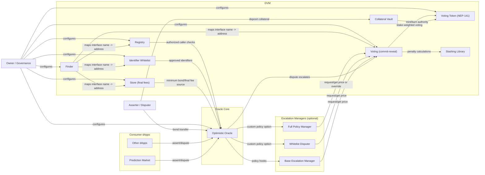
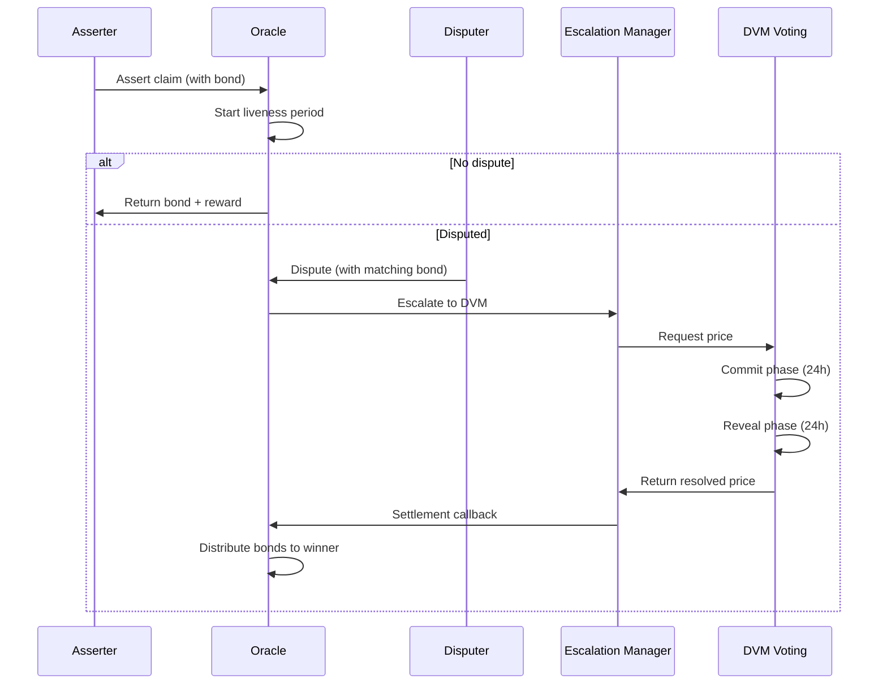

# Nest - Optimistic Oracle for NEAR

An optimistic oracle implementation for NEAR Protocol, inspired by UMA's Optimistic Oracle V3.

## Architecture



## Dispute Resolution Flow



## Contracts

Each contract has its own README with detailed deployment commands.

### Core Oracle

| Contract | Description | Docs |
|----------|-------------|------|
| **Optimistic Oracle** | Main entry point. Accepts assertions with bonds, handles disputes and settlements. | [README](contracts/optimistic-oracle/README.md) |

### DVM (Data Verification Mechanism)

| Contract | Description | Docs |
|----------|-------------|------|
| **Voting Token** | NEST governance/staking token with permissioned mint/burn and restricted transfer routes. | [README](contracts/dvm/voting-token/README.md) |
| **Vault** | Locks collateral and mints/burns NEST 1:1. | [README](contracts/dvm/vault/README.md) |
| **Finder** | Service discovery. Maps interface names to contract addresses. | [README](contracts/dvm/finder/README.md) |
| **Store** | Fee collection. Tracks final fees per currency. | [README](contracts/dvm/store/README.md) |
| **Identifier Whitelist** | Approved price identifiers for oracle requests. | [README](contracts/dvm/identifier-whitelist/README.md) |
| **Registry** | Authorized contracts that can interact with oracle. | [README](contracts/dvm/registry/README.md) |
| **Slashing Library** | Calculates penalties for incorrect votes. | [README](contracts/dvm/slashing-library/README.md) |
| **Voting** | Commit-reveal voting for dispute resolution. | [README](contracts/dvm/voting/README.md) |

### Escalation Managers

| Contract | Description | Docs |
|----------|-------------|------|
| **Base Escalation Manager** | Default implementation with permissive policies. | [README](contracts/escalation-manager/base/README.md) |
| **Whitelist Disputer** | Restricts disputes to whitelisted addresses. | [README](contracts/escalation-manager/whitelist-disputer/README.md) |
| **Full Policy Manager** | Configurable assertion/dispute policies with custom arbitration. | [README](contracts/escalation-manager/full-policy/README.md) |

### Examples

| Contract | Description |
|----------|-------------|
| **Basic Assertion** | Example integration with Optimistic Oracle. |

## Prerequisites

- [Rust](https://rustup.rs/)
- [cargo-near](https://github.com/near/cargo-near) - `cargo install cargo-near`
- [NEAR CLI](https://near.cli.rs) - `cargo install near-cli-rs`

## Building

```bash
# Build a single contract
cd contracts/optimistic-oracle && cargo near build non-reproducible-wasm

# Build all DVM contracts
for contract in voting-token vault finder store identifier-whitelist registry slashing-library voting; do
  (cd contracts/dvm/$contract && cargo near build non-reproducible-wasm)
done

# Build escalation managers (optional)
for contract in base whitelist-disputer full-policy; do
  (cd contracts/escalation-manager/$contract && cargo near build non-reproducible-wasm)
done

# Build optimistic oracle
(cd contracts/optimistic-oracle && cargo near build non-reproducible-wasm)
```

Output WASM files are in `target/near/<contract_name>/<contract_name>.wasm`

## Testing

```bash
# Run all unit tests
cargo test --workspace

# Run integration tests (requires built WASM files)
cargo test -p integration-tests

# Run a specific contract's tests
cargo test -p voting-token
cargo test -p optimistic-oracle
```

## Deployment Guide

### Current Testnet Deployment

The following contracts are currently deployed on NEAR testnet:

| Contract | Address |
|----------|---------|
| Voting Token (NEST) | `nest-token-2.testnet` |
| Vault | `nest-vault-2.testnet` |
| Collateral Token (mockNEAR) | `mocknear-1.testnet` |
| Finder | `nest-finder-2.testnet` |
| Store | `nest-store-2.testnet` |
| Identifier Whitelist | `nest-whitelist-1.testnet` |
| Registry | `nest-registry-2.testnet` |
| Slashing Library | `nest-slashing-2.testnet` |
| Voting | `nest-voting-4.testnet` |
| Optimistic Oracle | `nest-oracle-6.testnet` |
| **Owner** | `nest-owner-2.testnet` |
| **Treasury** | `nest-treasury-2.testnet` |

### Quick Start (Testnet)

#### 1. Build all contracts

See [Building](#building) section above.

#### 2. Deploy in order

Deploy contracts in this order (each depends on previous ones):

| Order | Contract | Suggested Account | Docs |
|-------|----------|------------------|------|
| 1 | Voting Token | `nest-token.testnet` | [README](contracts/dvm/voting-token/README.md) |
| 2 | Vault | `nest-vault.testnet` | [README](contracts/dvm/vault/README.md) |
| 3 | Finder | `nest-finder.testnet` | [README](contracts/dvm/finder/README.md) |
| 4 | Store | `nest-store.testnet` | [README](contracts/dvm/store/README.md) |
| 5 | Identifier Whitelist | `nest-identifiers.testnet` | [README](contracts/dvm/identifier-whitelist/README.md) |
| 6 | Registry | `nest-registry.testnet` | [README](contracts/dvm/registry/README.md) |
| 7 | Slashing Library | `nest-slashing.testnet` | [README](contracts/dvm/slashing-library/README.md) |
| 8 | Voting | `nest-voting.testnet` | [README](contracts/dvm/voting/README.md) |
| 9* | Base Escalation Manager | `nest-escalation-base.testnet` | [README](contracts/escalation-manager/base/README.md) |
| 10* | Whitelist Disputer | `nest-escalation-whitelist.testnet` | [README](contracts/escalation-manager/whitelist-disputer/README.md) |
| 11* | Full Policy Manager | `nest-escalation-full.testnet` | [README](contracts/escalation-manager/full-policy/README.md) |
| 12 | Optimistic Oracle | `nest-oracle.testnet` | [README](contracts/optimistic-oracle/README.md) |

**\*Optional:** Escalation managers are only needed if you want to customize assertion/dispute behavior.

#### 3. Post-deployment configuration

After deploying all contracts, complete the configuration steps in **[POST_DEPLOYMENT.md](POST_DEPLOYMENT.md)**.

**Quick summary:**
1. Deploy and initialize Vault with collateral + NEST token addresses
2. Set vault on VotingToken (`set_vault_account`) and allow Voting router (`add_transfer_router`)
3. Register required storage accounts on NEST/collateral tokens (vault, voting, treasury, users)
4. Register all interfaces in Finder
5. Whitelist price identifiers (ASSERT_TRUTH, YES_OR_NO_QUERY)
6. Set final fees in Store
7. Whitelist currencies in Oracle
8. Register Oracle in Registry

See [POST_DEPLOYMENT.md](POST_DEPLOYMENT.md) for complete step-by-step commands with verification.

For scripted testnet rollout (accounts + deploy + init + wiring), use:
`scripts/deploy-testnet.sh`

## Links

- [NEAR Rust SDK](https://docs.near.org/sdk/rust/introduction)
- [UMA Protocol](https://docs.uma.xyz/)
