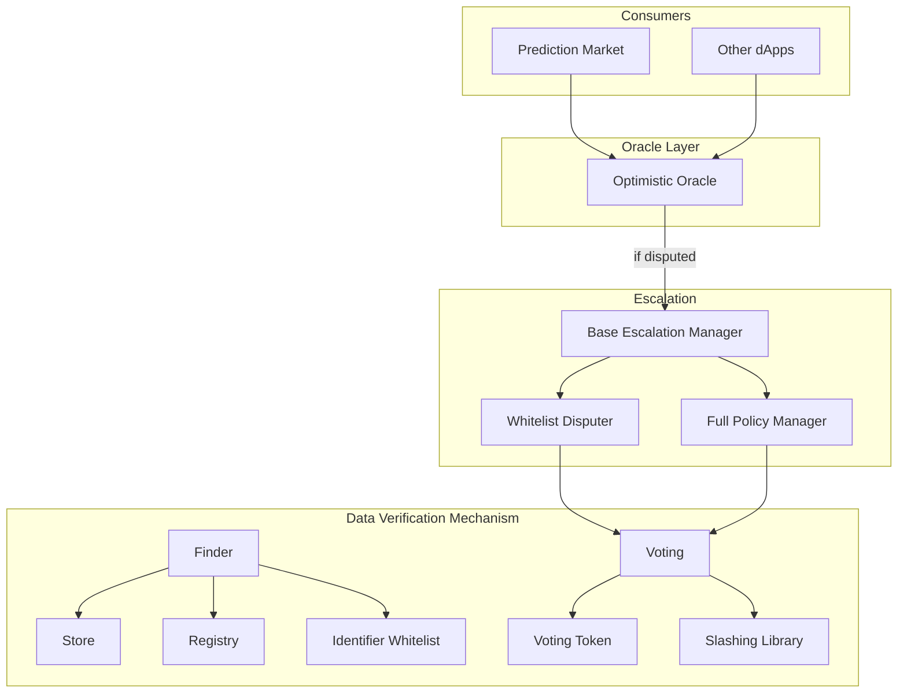
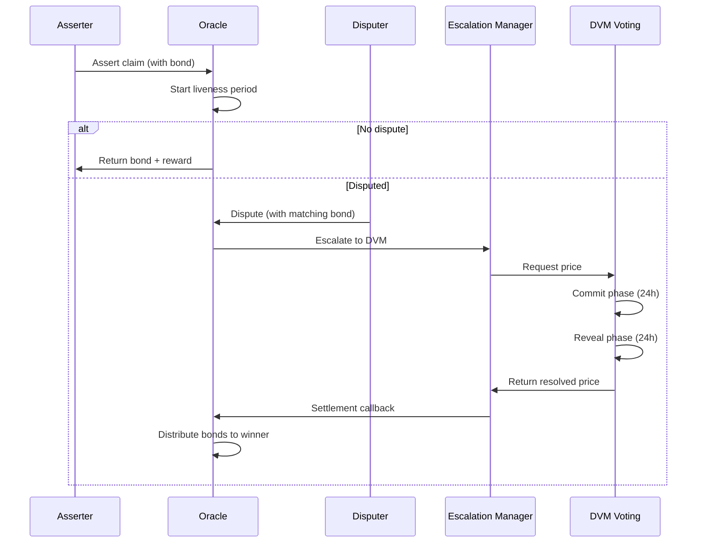

# Nest - Optimistic Oracle for NEAR

An optimistic oracle implementation for NEAR Protocol, inspired by UMA's Optimistic Oracle V3.

## Architecture



## Dispute Resolution Flow



## Contracts

### Core Oracle

**Optimistic Oracle** (`contracts/optimistic-oracle`)

The main entry point for the system. Accepts assertions with bonded stakes, enforces liveness periods during which assertions can be disputed, and settles assertions by distributing bonds to the correct party.

### Escalation Managers

**Base Escalation Manager** (`contracts/escalation-manager/base`)

Abstract base implementation defining the interface for escalation policies. Provides hooks for assertion validation, dispute handling, and price resolution callbacks.

**Whitelist Disputer** (`contracts/escalation-manager/whitelist-disputer`)

Restricts who can dispute assertions to a predefined set of addresses. Useful for controlled environments where only trusted parties should challenge claims.

**Full Policy Manager** (`contracts/escalation-manager/full-policy`)

Comprehensive escalation manager with configurable policies for assertion validation, dispute windows, and bond requirements. Supports blocking certain asserters or claims.

### DVM (Data Verification Mechanism)

**Voting Token** (`contracts/dvm/voting-token`)

NEP-141 fungible token used for governance voting in the DVM. Token holders stake to participate in dispute resolution and earn rewards for voting correctly.

**Finder** (`contracts/dvm/finder`)

Service discovery contract that maps interface names to contract addresses. Enables upgradability without hardcoding addresses throughout the system.

**Store** (`contracts/dvm/store`)

Manages fee collection and distribution for the oracle system. Tracks final fees per currency and handles payouts to voters and the protocol.

**Identifier Whitelist** (`contracts/dvm/identifier-whitelist`)

Maintains the list of approved price identifiers for oracle requests. Prevents arbitrary or malicious identifiers from being submitted to the DVM.

**Registry** (`contracts/dvm/registry`)

Tracks which contracts are authorized to interact with the oracle system. Only registered contracts can submit price requests to the DVM.

**Slashing Library** (`contracts/dvm/slashing-library`)

Calculates penalties for voters who vote against the resolved outcome. Implements configurable slashing rates to incentivize honest voting.

**Voting** (`contracts/dvm/voting`)

Core commit-reveal voting mechanism for dispute resolution. Voters commit hashed votes, then reveal them. Final price is determined by stake-weighted median.

### Examples

**Basic Assertion** (`contracts/examples/basic-assertion`)

Example contract demonstrating integration with the Optimistic Oracle. Shows the pattern for making assertions via `ft_transfer_call` and handling callbacks.

## Prerequisites

- [Rust](https://rustup.rs/)
- [cargo-near](https://github.com/near/cargo-near) - `cargo install cargo-near`
- [NEAR CLI](https://near.cli.rs) - `cargo install near-cli-rs`

## Building

```bash
cd contracts/optimistic-oracle && cargo near build non-reproducible-wasm
```

## Testing

```bash
cargo test --workspace
```

## Deployment Order

1. VotingToken
2. Finder
3. Store
4. IdentifierWhitelist
5. Registry
6. SlashingLibrary
7. Voting
8. Escalation Manager(s)
9. Optimistic Oracle

## Links

- [NEAR Rust SDK](https://docs.near.org/sdk/rust/introduction)
- [UMA Protocol](https://docs.uma.xyz/)
